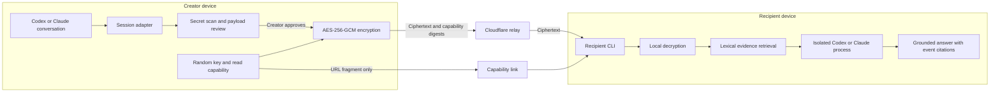

# AgentShare

**Encrypted, review-before-send context handoff for Codex and Claude Code.**

[](https://github.com/amazing-aaryan/AgentShare/actions/workflows/ci.yml)
[](https://github.com/amazing-aaryan/AgentShare/releases/latest)
[](https://nodejs.org/)
[](LICENSE)

AgentShare packages selected agent conversation context, shows the creator the
exact normalized plaintext, encrypts it locally, and produces a link that a
coworker can open with an isolated Codex or Claude Code session. The public
relay stores ciphertext, never conversation plaintext or decryption keys.

> [!IMPORTANT] AgentShare is a public beta. Do not share production credentials,
> regulated data, or other high-risk material. Review the complete payload
> before upload.

## Quick Start

### 1. Install

Requirements: Node.js 22 or newer, plus Codex CLI or Claude Code.

Ask your agent to install AgentShare by pasting this prompt:

```text
Install AgentShare v0.1.7 from its immutable GitHub release.

1. Confirm Node.js 22 or newer is installed.
2. Run:
   npm install --global https://github.com/amazing-aaryan/AgentShare/releases/download/v0.1.7/agentshare-0.1.7.tgz
3. Run: agentshare init
4. Run: agentshare
5. Confirm the CLI usage appears, list the installed integration files, and
   remind me to start a new agent session. Do not share context yet.
```

Manual install:

```powershell
npm install --global https://github.com/amazing-aaryan/AgentShare/releases/download/v0.1.7/agentshare-0.1.7.tgz
agentshare init
```

Start a new agent session so the host discovers the integration.

### 2. Share

| Creator host | Command       |
| ------------ | ------------- |
| Codex        | `$agentshare` |
| Claude Code  | `/share`      |

AgentShare shows the selected events, redactions, final normalized plaintext,
fingerprint, relay expiry, and size limit. Nothing uploads until you approve
both prompts. Send the resulting capability link to your coworker.

Direct CLI equivalents:

```powershell
agentshare share --current --source codex
agentshare share --current --source claude
agentshare share ./context.md --source generic
```

### 3. Open

The recipient does not need a global installation:

1. Open the capability link in a browser.
2. Choose Codex or Claude Code.
3. Copy and run the pinned command shown on the page.
4. Copy the secure link and paste it into the hidden terminal prompt.
5. Ask questions at the `agentshare>` prompt; use `/exit` when finished.

Pinned Codex command:

```powershell
npm exec --yes --package=https://github.com/amazing-aaryan/AgentShare/releases/download/v0.1.7/agentshare-0.1.7.tgz -- agentshare open --target codex
```

Replace `codex` with `claude` to use Claude Code. If browser clipboard access is
blocked, the page selects the secure link so it can be copied manually.

## How It Works



The link format is:

```text
https://relay.example/s/<share-id>#r=<read-capability>&k=<encryption-key>
```

URL fragments are not sent in HTTP requests. The share page removes the secret
fragment from visible browser history immediately, loads no third-party assets,
and sends no analytics. The recipient CLI uses the fragment locally to
authenticate, download, verify, and decrypt the bundle.

## Capabilities

| Capability                                 | Current behavior                                                                                                                                     |
| ------------------------------------------ | ---------------------------------------------------------------------------------------------------------------------------------------------------- |
| Share current Codex or Claude conversation | Yes. Host adapter exports user and assistant message text from the identified current session.                                                       |
| Share a text file                          | Yes. Explicit path only, up to 5 MiB.                                                                                                                |
| Read arbitrary creator workspace files     | No. `--current` reads the matching host transcript; it does not crawl the project.                                                                   |
| Transfer original files automatically      | No. Facts from files are included only when their contents already appear in exported conversation text or an explicit text file is shared.          |
| Multiple recipients                        | Yes. A link is reusable by concurrent readers until expiry or revocation.                                                                            |
| One-time or per-recipient access           | No. Everyone with the link shares the same bearer capability and key.                                                                                |
| Follow-up conversation                     | Yes. AgentShare keeps the eight most recent question/answer turns in memory.                                                                         |
| Citations                                  | Yes. Answers cite bundle source/event identifiers such as `[session#event-4]`. These prove bundle provenance, not external truth.                    |
| Recipient project file access              | No. Target agents run in a temporary workspace with tools disabled; Codex is read-only and network-disabled, and Claude receives an empty tool list. |
| Web search or external fact-checking       | No. Recipient agents answer only from retrieved bundle evidence.                                                                                     |
| Persistent recipient session               | No. Each target process is ephemeral; decrypted context, retrieval index, and chat history are memory-only.                                          |

### Information Quality

AgentShare transfers context faithfully, but it does not make that context true.
Answers are only as reliable as the shared transcript. Local lexical retrieval
selects up to eight matching events, capped at 4,000 characters each, for each
question. Reword queries when a relevant fact uses different terminology.

Use citations to inspect which transcript event supports a claim. Do not treat
them as independent verification of source code, live systems, web content, or
facts that were never included in the bundle.

The recipient CLI decrypts the complete bundle locally. For each question, it
sends the question, recent AgentShare conversation, and selected evidence
excerpts to the chosen model provider through the recipient's authenticated
Codex or Claude CLI. OpenAI or Anthropic therefore receives those excerpts under
the recipient's account and terms; the Cloudflare relay does not.

### Multiple Readers and Deployments

A share is not consumed when opened. Multiple people, machines, Codex sessions,
and Claude sessions can use the same link simultaneously. Any holder can also
forward it, so treat the entire URL as a secret. Revocation invalidates all
readers at once; expiration is currently capped at 72 hours.

Normal Worker code deployments preserve links when they keep the same Cloudflare
Durable Object bindings and storage. A link is tied to its relay origin and data
namespace; it does not move automatically to another relay, account, or reset
storage deployment.

## Security Model

- AES-256-GCM encryption and decryption happen on client devices.
- The relay receives ciphertext, SHA-256 digests, timestamps, sizes, and status.
- Raw upload, read, and revoke capabilities are not stored by the relay.
- Encryption keys remain in URL fragments and never reach the relay.
- Ciphertext integrity, authenticated metadata, resource length, and SHA-256 are
  checked before recipient use.
- Upload retries and repeated creates are idempotent; an existing blob cannot be
  replaced with different ciphertext.
- Creator state stores live links and revocation capabilities in
  `~/.agentshare/state-v1.json` with mode `0600` where supported.
- Target launchers fail closed on unreviewed Codex or Claude versions.

The target CLIs must read their own authentication material to contact their
model provider. Codex may also enumerate local skill metadata during startup,
but AgentShare disables its project filesystem, shell, patch, network, search,
app, plugin, and other tool surfaces before supplying shared evidence. Creator
agents retain whatever project permissions the user independently granted them;
invoking AgentShare does not add broader file access.

Primary residual risks are link forwarding, clipboard/history leakage, creator
device compromise, plaintext in recipient process memory or OS swap, incomplete
secret detection, and incorrect or malicious content already present in the
shared context. See [SECURITY.md](SECURITY.md) for reporting and support policy.

## Limits

| Limit                       |         Public relay |
| --------------------------- | -------------------: |
| Maximum lifetime            |             72 hours |
| Default CLI lifetime        |               1 hour |
| Maximum encrypted bundle    |               50 MiB |
| Maximum explicit text input |                5 MiB |
| Active shares               |                5,000 |
| Active ciphertext           |                 4 GB |
| Create rate                 | 10 per minute per IP |
| Upload rate                 | 20 per minute per IP |

Public relay:
[`https://agentshare-relay.carnation-vermicelli.workers.dev`](https://agentshare-relay.carnation-vermicelli.workers.dev)

Creators can override it with `--relay URL` or `AGENTSHARE_RELAY`.

## Link Lifecycle

- **Reuse:** Sharing unchanged context reuses the creator's unexpired link by
  default. Add `--new` to create a separate link.
- **Retry:** Interrupted uploads resume from encrypted local pending state.
- **Revoke:** Run `agentshare revoke`, then paste the original link at the
  hidden prompt. Revocation requires the creator's local state.
- **Expire:** Relay-enforced expiry deletes ciphertext and releases capacity.

## Update or Remove

```powershell
# Update this pinned release and repair integrations
npm install --global https://github.com/amazing-aaryan/AgentShare/releases/download/v0.1.7/agentshare-0.1.7.tgz
agentshare repair

# Remove integrations and CLI
agentshare remove
npm uninstall --global agentshare
```

## Development

```powershell
npm ci
npm run format:check
npm run lint
npm run build
npm run test:coverage
npm run test:package
npm run test:edge-runtime
npm audit --audit-level=high
```

Strict release gate against the production relay and authenticated target CLIs:

```powershell
$env:AGENTSHARE_E2E_RELAY="https://agentshare-relay.carnation-vermicelli.workers.dev"
npm run test:release
```

The release gate tests production create/upload/open/revoke/expiry semantics and
real Codex and Claude filesystem/network isolation. A one-agent diagnostic is
available through `npm run test:live:diagnostic`, but is not a release pass.

Local relay development:

```powershell
npm run start:relay
agentshare share --current --source codex --relay http://127.0.0.1:8787
```

See the [reviewed blueprint](plans/agentshare-v0-blueprint.md),
[host capability ADR](docs/adr/0001-host-capability-gates.md),
[contribution guide](CONTRIBUTING.md), and [security policy](SECURITY.md).

## License

[Apache-2.0](LICENSE)
