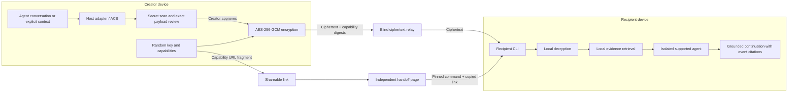

# AgentShare

**The open, free protocol for securely handing AI context to anyone.**

[](https://github.com/amazing-aaryan/AgentShare/actions/workflows/ci.yml)
[](https://github.com/amazing-aaryan/AgentShare/releases/latest)
[](https://nodejs.org/)
[](LICENSE)

AgentShare turns selected AI working context into a capability link you can send
to another person, machine, or agent. The sender reviews what will cross the
boundary, AgentShare encrypts it locally, and the public relay stores ciphertext
instead of conversation plaintext or decryption keys. A recipient with the
complete link decrypts locally and continues with a supported agent.

Today the first-class creator and recipient integrations are **Codex** and
**Claude Code**. The long-term interoperability boundary is the open
[Agent Context Bundle](docs/protocol/acb-v1.md), not either vendor's session
format.

> **AgentShare is for context transport, not context ownership.** Your context
> passes through AgentShare; it does not become an AgentShare workspace,
> account, or knowledge base.

Read the [project vision](docs/VISION.md) and
[open-context transport ADR](docs/adr/0005-open-context-transport.md).

> [!IMPORTANT] AgentShare is a public beta. Do not share production credentials,
> regulated data, or other high-risk material. Review all displayed text and the
> binary resource inventory before upload.

## Principles

- **Free forever.** AgentShare is not a freemium product and has no paid tier as
  a goal. The public service may enforce reasonable anti-abuse, size, lifetime,
  and capacity limits so it can remain a free shared service.
- **Open source forever.** The protocol, client, relay/handoff implementation,
  and the pieces needed to interoperate or self-host stay auditable and open.
- **No AgentShare accounts.** The complete link is the access capability. No
  shared company, Slack workspace, team invite, seat, or identity provider is
  required.
- **Cross-boundary by default.** Send a handoff to a coworker, cofounder,
  freelancer, client, open-source maintainer, friend, another machine, or anyone
  else you deliberately give the link to.
- **Blind transport.** The normal AgentShare relay does not need conversation
  plaintext or the encryption key to deliver a share.
- **Review before send.** Secret scanning helps, but the sender remains the
  authority over what leaves the device.
- **Agent-agnostic direction.** Codex and Claude Code are current adapters, not
  the permanent definition of AgentShare.

## Quick Start

### 1. Install

Requirements: Node.js 22 or newer, plus Codex CLI or Claude Code.

Ask your agent to install AgentShare by pasting:

```text
Install AgentShare v0.1.11 from its immutable GitHub release.

1. Confirm Node.js 22 or newer is installed.
2. Run:
   npm install --global https://github.com/amazing-aaryan/AgentShare/releases/download/v0.1.11/agentshare-0.1.11.tgz
3. Run: agentshare init
4. Run: agentshare
5. Confirm the CLI usage appears, list the installed integration files, and
   remind me to start a new agent session. Do not share context yet.
```

Manual install:

```powershell
npm install --global https://github.com/amazing-aaryan/AgentShare/releases/download/v0.1.11/agentshare-0.1.11.tgz
agentshare init
```

Start a new agent session so the host discovers the integration.

### 2. Share

| Creator host | Command       |
| ------------ | ------------- |
| Codex        | `$agentshare` |
| Claude Code  | `/share`      |

AgentShare shows the selected events, redactions, normalized text, fingerprint,
relay expiry, size limits, and binary resource metadata. Text is displayed
exactly after normalization and redaction. Binary bytes are not printed
byte-for-byte; binary resources are identified by media type, byte length, and
SHA-256 and scanned for suspected secrets in supported text views. Nothing
uploads until you approve both review steps.

Then send the resulting **complete capability link** to whoever should have
access.

Direct CLI equivalents:

```powershell
agentshare share --current --source codex
agentshare share --current --source claude
agentshare share ./context.md --source generic
```

### 3. Open

The recipient does not need a global AgentShare installation or AgentShare
account:

1. Open the capability link in a browser.
2. Choose Codex or Claude Code.
3. Copy and run the pinned command shown on the page.
4. Copy the secure link and paste it into the hidden terminal prompt.
5. Ask questions at the `agentshare>` prompt; use `/exit` when finished.

Pinned Codex command:

```powershell
npm exec --yes --package=https://github.com/amazing-aaryan/AgentShare/releases/download/v0.1.11/agentshare-0.1.11.tgz -- agentshare open --target codex
```

Replace `codex` with `claude` to use Claude Code. If browser clipboard access is
blocked, the page selects the secure link so it can be copied manually.

## The Use Case

AI work contains state that final files often do not: failed attempts,
decisions, constraints, discoveries, unresolved questions, and why the current
approach exists. AgentShare lets another person or agent inherit that working
context without requiring both sides to use the same AI product or belong to the
same organization.

Typical handoffs include:

- indie hacker to collaborator;
- cofounder to cofounder;
- open-source contributor to maintainer;
- consultant to client;
- one developer to another across company boundaries;
- laptop to workstation;
- one supported agent to another.

The core primitive is intentionally small:

**context -> review -> encrypted capability link -> recipient agent**

## How It Works



New-format links use an AgentShare-controlled handoff origin separate from the
ciphertext relay. The selected relay origin is non-secret query metadata; the
read capability and encryption key remain in the URL fragment:

```text
https://agentshare-handoff.carnation-vermicelli.workers.dev/s/<share-id>?relay=https%3A%2F%2Frelay.example#r=<read-capability>&k=<encryption-key>
```

Browsers do not send URL fragments as part of the HTTP request. The trusted
handoff page reads the fragment locally in browser JavaScript, removes query and
fragment data from visible browser history, loads no third-party assets, sends
no analytics, and sends only the read capability to the selected relay for
metadata checks. The encryption key is not sent to the relay.

See [SECURITY.md](SECURITY.md) and the
[Blind Relay Protocol](docs/protocol/relay-v1.md) for the exact trust boundary,
including legacy-link behavior and residual risks.

## Capability Links Are the Permission Model

AgentShare does not require a central identity system for the core handoff.
Everyone with the complete link has the same bearer read capability and key
until the share expires or is revoked. A share can therefore cross teams,
companies, communities, and machines without an AgentShare invite flow.

That portability has a clear security consequence: **treat the complete link as
a secret**. Anyone who obtains it may be able to read the share while it remains
valid. Revocation invalidates all readers of that link at once.

## Current Capabilities

| Capability                                 | Current behavior                                                                                                                                |
| ------------------------------------------ | ----------------------------------------------------------------------------------------------------------------------------------------------- |
| Share current Codex or Claude conversation | Yes. Host adapters export user and assistant message text from the identified current session.                                                  |
| Share an explicit text file                | Yes. Explicit path only, up to 5 MiB.                                                                                                           |
| Read arbitrary creator workspace files     | No. `--current` reads the matching host transcript; it does not crawl the project.                                                              |
| Transfer original files automatically      | No. File facts transfer only when their contents already appear in exported conversation text or an explicit supported resource is shared.      |
| Multiple recipients                        | Yes. A link is reusable by concurrent readers until expiry or revocation.                                                                       |
| Per-recipient identity or accounts         | No by design for the core flow. Everyone with the complete link uses the bearer capability.                                                     |
| Follow-up conversation                     | Yes. AgentShare keeps the eight most recent question/answer turns in memory.                                                                    |
| Citations                                  | Yes. Answers cite bundle source/event identifiers such as `[session#event-4]`; these prove bundle provenance, not external truth.               |
| Recipient project file access              | No. Target agents run in a temporary workspace with tools disabled; Codex is read-only/network-disabled and Claude receives an empty tool list. |
| Web search or external fact-checking       | No. Recipient agents answer only from retrieved bundle evidence.                                                                                |
| Persistent recipient session               | No. Each target process is ephemeral; decrypted context, retrieval index, and chat history are memory-only.                                     |

### Information quality

AgentShare transfers context faithfully; it does not make that context true.
Answers are only as reliable as the shared material. Local lexical retrieval
selects up to eight matching events, capped at 4,000 characters each, for each
question. Reword queries when a relevant fact uses different terminology.

The recipient CLI decrypts the complete bundle locally. For each question, it
sends the question, recent AgentShare conversation, and selected evidence
excerpts through the recipient's authenticated Codex or Claude CLI. The chosen
model provider therefore receives those excerpts under the recipient's account
and terms; the AgentShare ciphertext relay does not.

## Security Model

Key properties:

- AES-256-GCM encryption and decryption happen on client devices.
- The relay receives ciphertext, SHA-256 capability digests, timestamps, sizes,
  quota/admission data, and status rather than share plaintext or decryption
  keys.
- Raw upload, read, and revoke capabilities are not stored by the relay.
- The encryption key remains in the URL fragment and is not sent to the relay.
- Ciphertext integrity, authenticated metadata, resource length, and SHA-256 are
  checked before recipient use.
- Creator state retains live links and revocation capabilities locally in
  `~/.agentshare/state-v1.json` with mode `0600` where supported.
- Recipient launchers combine reviewed version profiles with runtime capability
  checks and fail closed if the required isolation controls are unavailable.

Reviewed recipient versions are tracked in
[docs/recipient-compatibility.md](docs/recipient-compatibility.md). At the
current v0.1.11 documentation state, reviewed support includes Codex CLI
`0.145.0` through `0.147.0` and selected Claude Code releases through `2.1.238`;
Codex `0.149.0` remains blocked because the required Windows isolation contract
could not be enforced during review.

Primary residual risks include capability-link forwarding or leakage,
clipboard/history exposure, trusted-handoff-origin compromise, creator or
recipient device compromise, plaintext in recipient process memory or OS swap,
incomplete secret detection, and incorrect or malicious content already present
in the shared context.

## Open Protocol Surface

AgentShare currently documents two core interoperable objects:

- [Agent Context Bundle v1](docs/protocol/acb-v1.md): canonical representation
  of reviewed agent context and resources.
- [Blind Relay Protocol v1](docs/protocol/relay-v1.md): capability-based,
  write-once encrypted share transport.

Future host adapters should translate to/from these open boundaries rather than
turn AgentShare into a vendor-specific session store.

## Public Relay Limits

| Limit                       |         Public relay |
| --------------------------- | -------------------: |
| Maximum lifetime            |             72 hours |
| Default CLI lifetime        |               1 hour |
| Maximum encrypted bundle    |               50 MiB |
| Maximum explicit text input |                5 MiB |
| Active shares               |                5,000 |
| Active shares per source IP |                   25 |
| Active ciphertext           |                 4 GB |
| Unuploaded reservation      |           10 minutes |
| Create rate                 | 10 per minute per IP |
| Upload rate                 | 20 per minute per IP |

Public relay:
[`https://agentshare-relay.carnation-vermicelli.workers.dev`](https://agentshare-relay.carnation-vermicelli.workers.dev)

Trusted handoff origin:
[`https://agentshare-handoff.carnation-vermicelli.workers.dev`](https://agentshare-handoff.carnation-vermicelli.workers.dev)

Creators can override the ciphertext relay with `--relay URL` or
`AGENTSHARE_RELAY`. Self-hosting is part of the open protocol model, not a paid
or enterprise-only feature.

## Link Lifecycle

- **Reuse:** Sharing unchanged context finds the newest unexpired matching link
  and asks whether to reuse it. Declining creates a fresh link; `--new` skips
  reuse lookup.
- **Retry:** Interrupted uploads resume from encrypted local pending state.
- **Revoke:** Run `agentshare revoke`, then paste the exact link at the hidden
  prompt. Locally retained live links keep their own revocation credential.
- **Expire:** Relay-enforced expiry deletes ciphertext and releases capacity.

## Update or Remove

Successful creator commands perform a best-effort release check at most once per
24 hours. Update notices go to stderr and never install code silently. Set
`AGENTSHARE_NO_UPDATE_CHECK=1` to disable passive checks.

```powershell
agentshare update --check
agentshare update

# Manual recovery
npm install --global https://github.com/amazing-aaryan/AgentShare/releases/download/v0.1.11/agentshare-0.1.11.tgz
agentshare repair

# Remove integrations and CLI
agentshare remove
npm uninstall --global agentshare
```

The updater accepts only exact stable releases from the canonical AgentShare
repository, derives the immutable tarball URL locally, verifies the installed
CLI version, and then runs the new CLI's `repair`. AgentShare-managed
integration files are refreshed; conflicting unmanaged skill files are left
untouched.

## Development

```powershell
npm ci
npm run format:check
npm run lint
npm run build
npm run test:coverage
npm run test:package
npm run test:edge-runtime
npx wrangler deploy --dry-run --config apps/edge-relay/wrangler.jsonc
npx wrangler deploy --dry-run --config apps/handoff/wrangler.jsonc
npm audit --audit-level=high
```

Strict live release gate:

```powershell
$env:AGENTSHARE_E2E_RELAY="https://agentshare-relay.carnation-vermicelli.workers.dev"
$env:AGENTSHARE_E2E_HANDOFF="https://agentshare-handoff.carnation-vermicelli.workers.dev"
npm run test:release
```

The release gate requires distinct live HTTPS relay and handoff origins and
exercises the real handoff page/security headers, relay semantics, and real
Codex/Claude filesystem and network isolation. See the
[Cloudflare deployment runbook](docs/operations/cloudflare-deployment.md).

Local relay development:

```powershell
npm run start:relay
agentshare share --current --source codex --relay http://127.0.0.1:8787
```

See also the [contribution guide](CONTRIBUTING.md),
[security policy](SECURITY.md), [protocol docs](docs/protocol/), and historical
[construction plans](plans/README.md).

## What We Intentionally Are Not Building

AgentShare's base project is not intended to become a paid SaaS workspace,
company transcript archive, social network for AI sessions, enterprise
seat-management system, employee-monitoring product, or proprietary agent
runtime. Third parties are free to build other experiences on compatible open
context and relay protocols.

## License

Apache-2.0. AgentShare is intended to remain free and open source.
