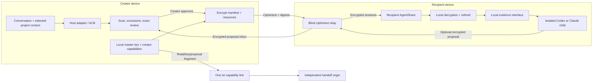

# AgentShare

**The open, free protocol for securely handing AI context to anyone.**

[](https://github.com/amazing-aaryan/AgentShare/actions/workflows/ci.yml)
[](https://github.com/amazing-aaryan/AgentShare/releases/latest)
[](https://nodejs.org/)
[](LICENSE)

AgentShare turns reviewed AI working context into one encrypted capability link
that can cross people, machines, companies, and agent vendors. The creator
chooses what to share, reviews the exact boundary, and encrypts locally. The
normal relay stores ciphertext rather than conversation/workspace plaintext or
decryption keys. The recipient decrypts locally and continues with a supported
agent under their own provider account.

Today the first-class creator and recipient integrations are **Codex** and
**Claude Code**. The long-term interoperability boundary is the open
[Agent Context Bundle](docs/protocol/acb-v1.md), not either vendor's session
format.

> **AgentShare is for context transport, not context ownership.** Your context
> passes through AgentShare; it does not become an AgentShare workspace,
> account, company transcript database, or knowledge base.

Read the [project vision](docs/VISION.md), [roadmap](docs/ROADMAP.md), and
[open-context transport ADR](docs/adr/0005-open-context-transport.md).

> [!IMPORTANT] AgentShare is a public beta. Do not share production credentials,
> regulated data, or other high-risk material. Review the final normalized text,
> included files, exclusions, and redactions before publication.

> [!NOTE] This repository contains the v0.2 collaborative-environment candidate.
> It is not a stable public v0.2.0 release until the immutable package, live
> Cloudflare deployment, and authenticated Codex/Claude release gates in the
> [deployment runbook](docs/operations/cloudflare-deployment.md) pass. Until
> then, use the current stable GitHub release for production installation.

## Principles

- **Free forever.** No paid tier is a project goal. Public infrastructure may
  use transparent size, lifetime, rate, and capacity limits so it can remain
  free.
- **Open source forever.** The protocol, client, relay/handoff implementation,
  conformance vectors, and self-hosting surface remain auditable and open.
- **No AgentShare accounts.** Possession of the complete capability link is the
  base permission model. No shared company, Slack workspace, seat, or identity
  provider is required.
- **Cross-boundary by default.** A deliberate link can cross coworkers,
  cofounders, clients, open-source projects, companies, communities, or
  machines.
- **Blind transport.** The normal relay does not need share plaintext or
  decryption keys to deliver the encrypted environment.
- **Review before send.** Secret scanning is defense in depth; the creator is
  the authority over what crosses the boundary.
- **Agent-agnostic direction.** Codex and Claude Code are current adapters, not
  the permanent definition of AgentShare.

## The Ordinary Flow

The v2 product model is deliberately small:

**select context -> review -> send one link -> recipient chooses an agent ->
continue**

### 1. Install the stable CLI and integrations

Requirements: Node.js 22 or newer, plus a reviewed Codex CLI or Claude Code
version. Install the current immutable package from
[GitHub Releases](https://github.com/amazing-aaryan/AgentShare/releases), then
run:

```powershell
agentshare init
```

Start a new Codex or Claude Code session so the host discovers the managed
integration. Exact reviewed recipient versions are tracked in
[recipient compatibility](docs/recipient-compatibility.md).

### 2. Create a collaborative environment

| Creator host | Host command  |
| ------------ | ------------- |
| Codex        | `$agentshare` |
| Claude Code  | `/share`      |

Direct CLI equivalents:

```powershell
agentshare share --current --source codex
agentshare share --current --source claude
```

For a new environment, AgentShare asks the creator to choose:

- **scope:** conversation + project, conversation only, or project only;
- **access:** read + propose changes or read only;
- **expiry:** 1 hour, 24 hours, or 72 hours.

AgentShare then shows a publication summary with included files, exclusions,
redactions, access mode, and expiry. Creator selection and final review require
an interactive terminal. If a host shell cannot provide one, the managed skill
asks the user to run the command in a real terminal. There is no public `--yes`
approval bypass.

After approval, AgentShare prints one complete `/e/` capability link. Send that
link only to intended recipients.

### 3. Receive the link

A recipient with AgentShare integrations installed can paste the complete `/e/`
link directly into a supported Codex or Claude Code host. The receiver
integration treats the link as a bearer secret, attaches it locally, and does
not copy decrypted shared files into the recipient's current project.

The explicit CLI path is:

```powershell
agentshare bootstrap
```

Provide the capability link on stdin or through the command's interactive input,
not as a shell argument.

Ask questions against the latest approved revision with:

```powershell
agentshare ask --target codex --question "What remains unresolved?"
agentshare ask --target claude --question "What remains unresolved?"
```

AgentShare refreshes the environment locally and starts an isolated reviewed
child agent with only the local AgentShare evidence interface.

### 4. Propose a change

When the creator enabled proposal access, a recipient can explicitly request a
change:

```powershell
agentshare propose --target codex --instruction "Update the parser tests"
agentshare propose --target claude --instruction "Update the parser tests"
```

The recipient produces deterministic file operations against a specific base
revision, encrypts the proposal locally, and uploads only ciphertext. It never
writes the creator's workspace directly.

The creator reviews proposals through the creator-only inbox:

```powershell
agentshare inbox --source codex
agentshare inbox --source claude
```

Approved changes are applied against their reviewed base hashes and published as
a new encrypted revision.

### 5. Keep the same link or revoke it

Rerunning `agentshare share --current` in the creator workspace shows actions
for updating the existing environment, reviewing proposed changes, copying its
link, or creating a separate environment. A normal update advances the approved
revision while keeping the same recipient capability URL.

Force a completely separate environment with:

```powershell
agentshare share --current --source codex --new
```

Override the expiry for a newly created environment with an integer from 1
through 259200 seconds:

```powershell
agentshare share --current --source codex --new --ttl 3600
```

Use `--new` when a fresh expiry and fresh capability set are required; updating
an existing environment does not silently rotate its link.

Revoke a v2 environment with:

```powershell
agentshare revoke-environment --environment <environment-id>
```

Revocation invalidates that environment for every holder of the link.

## How v2 Works



A v2 capability link has this split-origin form:

```text
https://<handoff-origin>/e/<environment-id>?relay=https%3A%2F%2F<relay-origin>#r=<read-capability>&k=<environment-master-key>[&p=<proposal-capability>]
```

The `relay=` value is non-secret transport metadata. The read capability,
environment master key, and optional proposal capability are bearer secrets in
the URL fragment. Browsers do not send fragments as part of HTTP requests.
Creator-only update, inbox, revoke, and proposal-private-key material never goes
in the recipient URL.

See the [Environment v2 Protocol](docs/protocol/environment-v2.md) and
[Security Policy](SECURITY.md) for the complete trust boundary.

## What the Relay Can See

The official relay may store or observe ordinary transport metadata plus:

- environment/share identifiers;
- opaque ciphertext;
- ciphertext hashes and byte lengths;
- expiry/lifecycle state;
- SHA-256 digests of bearer capabilities;
- pseudonymous source/admission data used for free-service quotas.

It is not designed to receive:

- conversation or workspace plaintext;
- environment master keys or share encryption keys;
- raw creator update/inbox/revoke capabilities;
- recipient decrypted evidence;
- account, company, or organization membership data for the core flow.

The recipient's chosen model provider is a separate trust boundary. After local
decryption and retrieval, relevant evidence excerpts may be submitted through
the recipient's own Codex or Claude account and terms.

## Project Context Without a Shared Workspace

AI work contains state that final files often do not: failed attempts,
decisions, constraints, discoveries, unresolved questions, and why the current
approach exists. AgentShare is meant to carry that working state without forcing
both sides into the same chat product or company control plane.

Typical handoffs include:

- indie hacker to collaborator;
- cofounder to cofounder;
- open-source contributor to maintainer;
- consultant to client;
- one developer to another across company boundaries;
- laptop to workstation;
- one supported agent to another.

AgentShare transfers reviewed context; it does not make that context true. Model
answers remain limited by the shared evidence and the recipient model.

## Open Interoperability Surface

AgentShare currently documents three related but separable boundaries:

- [Agent Context Bundle v1](docs/protocol/acb-v1.md): canonical reviewed context
  and resources, with relay-independent conformance vectors;
- [Environment v2](docs/protocol/environment-v2.md): revisioned encrypted
  environments and proposals;
- [Blind Relay Protocol v1](docs/protocol/relay-v1.md): the original one-shot
  capability transport retained for compatibility.

Run the ACB conformance vectors without any AgentShare relay or network access:

```powershell
npm run test:conformance
```

Passing ACB conformance means agreeing on format encoding and integrity
behavior, not depending on the official AgentShare service.

## V1 Compatibility

The original one-shot `/s/` handoff remains available rather than being silently
reinterpreted by v2:

```powershell
agentshare share-v1 --current --source codex
agentshare share-v1 ./context.md --source generic
agentshare open --target codex
agentshare revoke
```

`agentshare share --legacy ...` also selects the v1 path. Existing v1 shares,
state machines, and revoke semantics stay distinct from v2 environments.

## Self-hosting

The official public deployment is the easiest default, not a proprietary
requirement. Configure compatible relay and handoff origins independently:

```powershell
agentshare share --current --source codex \
  --relay https://relay.example \
  --handoff https://handoff.example
```

Or set:

```text
AGENTSHARE_RELAY=https://relay.example
AGENTSHARE_HANDOFF=https://handoff.example
```

The handoff origin and ciphertext relay are intentionally separate so selecting
a custom relay does not also grant that relay control of browser JavaScript that
can read capability fragments.

Self-hosting is an interoperability property, not an enterprise SKU.

## Public-service Limits

The public service uses bounded resources so it can remain free. Current
protocol and production limits include a maximum 72-hour TTL, a 50 MiB
ciphertext bound, rate limits, active-object capacity controls, and
creator-attributed retained ciphertext accounting. Exact deployment policy lives
in the relay contracts and
[Cloudflare runbook](docs/operations/cloudflare-deployment.md).

Compatible self-hosted implementations may choose different operational limits
while preserving the capability and blind-content security boundary.

## Update or Remove

Stable installations can check for and explicitly install a newer stable release
with:

```powershell
agentshare update --check
agentshare update
```

Successful creator commands perform a best-effort release check at most once per
24 hours. They never install silently. Set `AGENTSHARE_NO_UPDATE_CHECK=1` to
disable passive checks. Drafts and prereleases are ignored by the updater.

Refresh managed integrations or remove them with:

```powershell
agentshare repair
agentshare remove
```

The updater and repair flow never overwrite conflicting unmanaged skill files.

## Development and Release Gates

```powershell
npm ci
node scripts/check-repository-hygiene.mjs
npm run format:check
npm run lint
npm run build
npm run test:coverage
npm run test:conformance
npm run test:package
npm run test:edge-runtime
npx wrangler deploy --dry-run --config apps/edge-relay/wrangler.jsonc
npx wrangler deploy --dry-run --config apps/handoff/wrangler.jsonc
npm audit --audit-level=high
```

CI runs the same core gate across Ubuntu, macOS, and Windows on Node.js 22
and 24. A stable public release additionally requires live split-origin
deployment verification and authenticated real Codex/Claude recipient-isolation
tests:

```powershell
$env:AGENTSHARE_E2E_RELAY="https://agentshare-relay.carnation-vermicelli.workers.dev"
$env:AGENTSHARE_E2E_HANDOFF="https://agentshare-handoff.carnation-vermicelli.workers.dev"
npm run test:release
```

A new agent adapter is not considered supported merely because it can receive a
prompt. It must prove creator extraction, capability handling, and recipient
isolation on exact reviewed releases.

## What We Intentionally Are Not Building

The base AgentShare project is not intended to become:

- a paid SaaS workspace or freemium funnel;
- an enterprise seat-management or mandatory SSO/SCIM system;
- a Slack replacement;
- a permanent company transcript or plaintext knowledge database;
- employee/agent productivity analytics;
- a social network for AI sessions;
- a proprietary model or agent runtime.

Third parties can build products on compatible open formats without changing the
base project's cross-boundary, account-free primitive.

## Contributing

See [CONTRIBUTING.md](CONTRIBUTING.md), [SECURITY.md](SECURITY.md), the
[protocol docs](docs/protocol/), and historical
[construction plans](docs/superpowers/README.md).

Apache-2.0.
